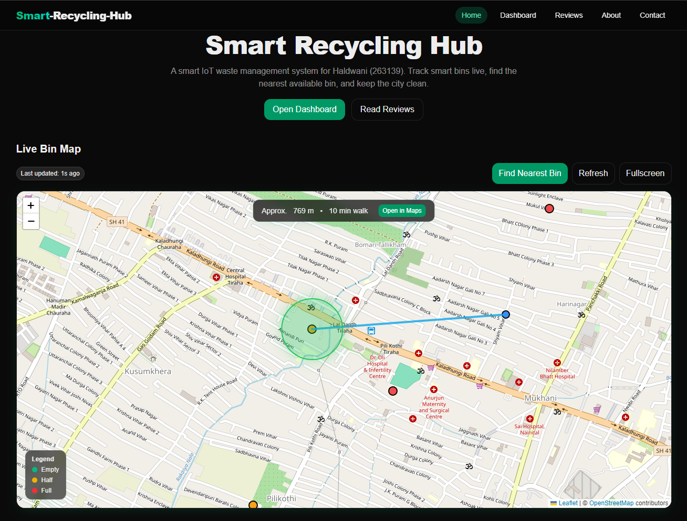
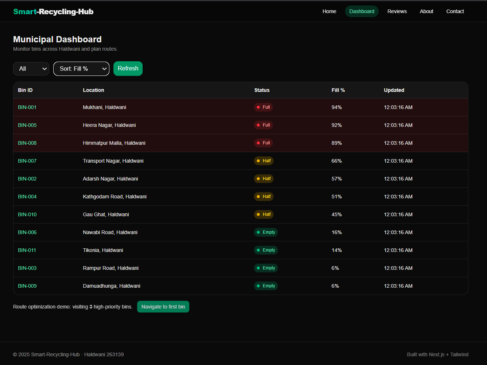
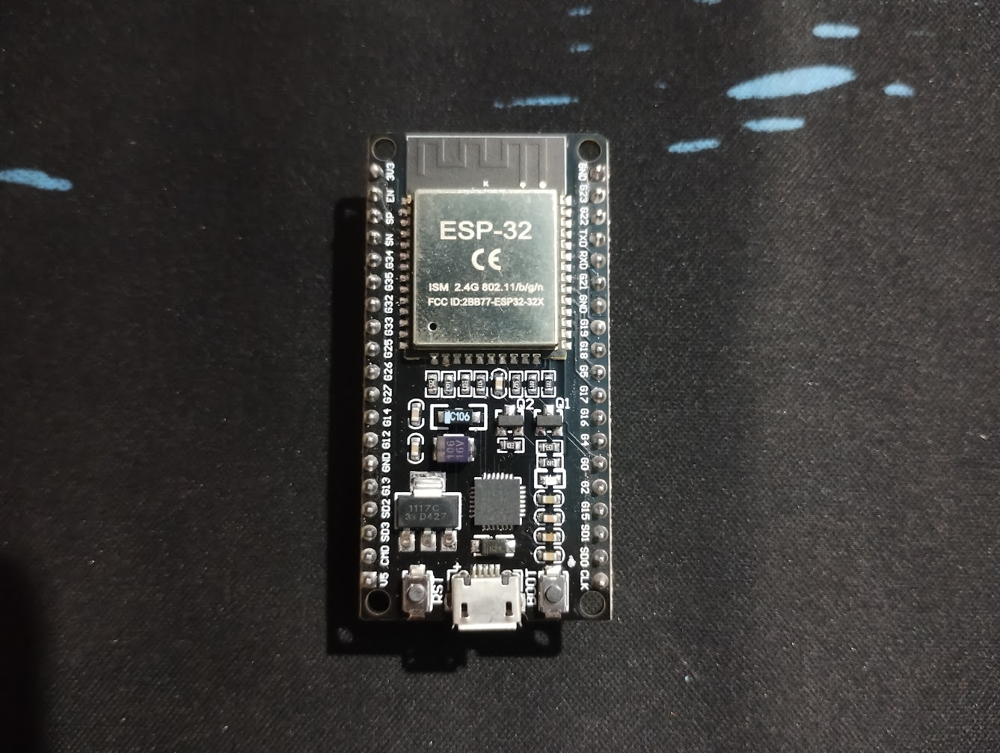
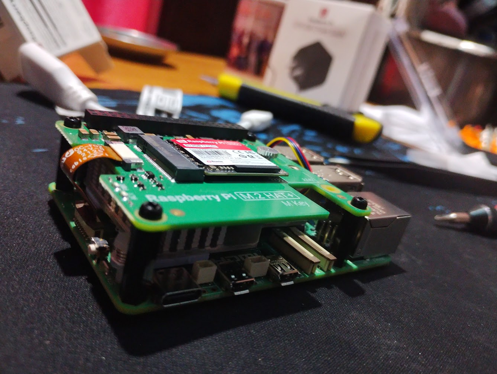
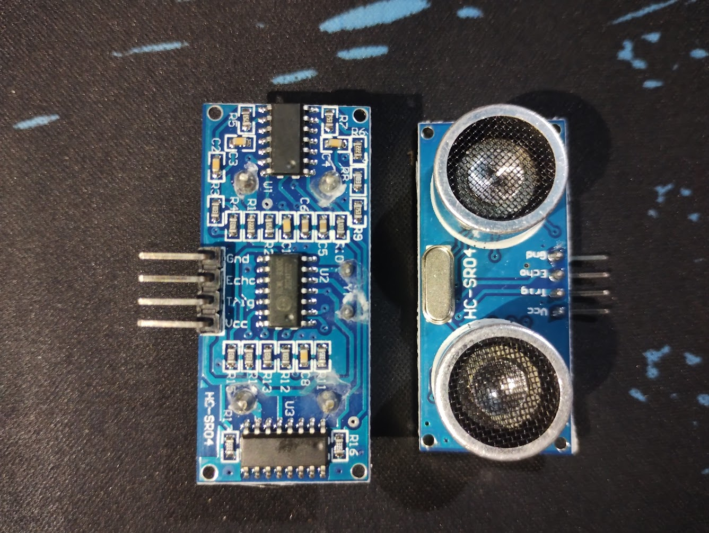

## Prototype Status (Phase 1)

This submission focuses on idea validation, system design, and feasibility analysis for Phase 1 of the competition.  
Prototype development and implementation will be carried out in the next phase upon selection.

All diagrams, images, charts, and visual materials included in this documentation have been **created by our team** specifically for this project and are intended for explanatory and demonstration purposes.

# Smart Waste Management & Citizen Engagement Platform

## Table of Contents

- [Problem Statement](#problem-statement)
- [Problem Explanation](#problem-explanation)
- [Proposed Solution](#proposed-solution)
  - [Overall System Design](#overall-system-design)
- [System Block-Flow Diagram](#system-block-flow-diagram)
- [Citizen Module](#citizen-module)
- [Smart Bin & IoT Integration](#smart-bin--iot-integration)
- [Waste Management Team Module](#waste-management-team-module)
- [Monitoring & Accountability](#monitoring--accountability)
- [Benefits of the Solution](#benefits-of-the-solution)
- [Technical Implementation](#technical-implementation)
  - [Hardware Components (Prototype-Level)](#hardware-components-prototype-level)
- [Feasibility Analysis](#feasibility-analysis)
- [Scalability & Deployment](#scalability--deployment)

## Problem Statement

Urban waste management in Indian cities lacks real-time visibility, citizen participation, and operational transparency. Garbage bins often overflow before collection, citizens have no reliable way to locate nearby bins or report issues, and waste management teams rely on fixed routes without accurate data on bin status. This leads to unhygienic surroundings, inefficient resource usage, delayed response to complaints, and lack of accountability in garbage collection processes.

---

## Problem Explanation

In many urban areas, *garbage collection still depends on fixed schedules and manual supervision rather than real-time information*. Garbage bins may __**overflow long before the scheduled pickup, while some bins are collected even when they are not full**__. Citizens are usually the first to notice problems such as overflowing bins, bad odor, or garbage dumped around bins, but existing complaint mechanisms are often slow, unorganized, or ineffective, resulting in delayed action. On the other hand, waste management teams do not have a single, reliable platform to monitor the live status of bins, receive verified reports from citizens, or plan collection routes based on actual need. This lack of coordination between citizens, bin status data, and waste collection teams leads to unhygienic surroundings, inefficient use of resources, poor accountability, and reduced overall cleanliness in cities.

---

## Proposed Solution

### Overall System Design

- A **unified, web-based smart waste management platform**
- Integrates **IoT bin data, citizen participation, and waste management operations**
-  *Have 3 modules:*
    - **Citizen Module,**
    - **Smart Bin & Iot Intergation, nad**
    - **Waste Management Team**
- Single platform with **role-based access** for different users
- Focuses on **real-time visibility, faster response, and transparency**
## System Block-Flow Diagram

> *Click the diagram to view the interactive version on Miro.*

---

## Citizen Module

- View **nearby garbage bin locations** on an interactive map
- Check **current fill status** of bins (Low / Medium / Full)

  >*Nearest available bin for proper waste disposal with current fill status*
- Easy access to the **nearest available bin** for proper waste disposal
- Citizen login for active participation
- Report garbage-related issues such as:
  - Overflowing bins
  - Garbage dumped around bins
  - Missed collection
- Attach **image and location** while reporting
- Reports are directly sent to the waste management team for action

---

## Smart Bin & IoT Integration

- Each bin is registered with:
  - Unique ID
  - Fixed geographic location
- IoT sensors monitor:
  - Bin fill level
- Real-time bin status is sent to the backend system
- Bin status is visually represented using color codes
- Reduces dependency on manual inspection

---

## Waste Management Team Module

- Secure login for sanitation and collection staff
- Live dashboard displaying:
  - Bin fill status
  - Citizen-reported issues with images

  
  >*high-priority bins on top*
- Identification of **high-priority bins**

- Identification of **high-priority bins**
- Route suggestions based on:
  - Bin fullness
  - Reported issues
  - Location proximity
- Ability to update bin status:
  - Garbage collected
  - Not collected / delayed
- Automatic generation of **collection logs with timestamps**

---

## Monitoring & Accountability

To ensure transparency and accountability in waste collection operations, the system maintains a detailed monitoring and logging mechanism for every registered garbage bin.

- Each garbage bin has a **collection history** that records when it was serviced and when it was not.
- Whenever a waste management team marks a bin as *collected* or *not collected*, the action is stored with a **timestamp** and bin identifier.
- These logs allow supervisors and authorities to verify:
  - Timeliness of garbage collection  
  - Missed or delayed pickups  
  - Repeated negligence in specific areas or routes
- Citizen-reported issues with images and location data act as an additional **verification layer**, reducing false reporting and improving trust.
- The availability of historical data enables performance evaluation of waste collection teams and helps identify problem zones that require attention.

> By maintaining transparent logs and verifiable records, the system reduces manual intervention, discourages negligence, and improves overall accountability in urban waste management.

---
## Benefits of the Solution

- Enables **faster response** to overflowing bins and garbage issues through real-time monitoring and citizen reports.
- Optimizes **fuel usage, time, and manpower** by avoiding unnecessary collection trips.
- Improves **urban cleanliness and public hygiene** by preventing bin overflow and illegal dumping.
- Encourages **active citizen participation** in maintaining city cleanliness.
- Provides **data-driven insights** to authorities for better planning and decision-making.
- Increases **transparency and accountability** in waste collection operations.
---

## Technical Implementation

- **Frontend**
  - React.js or Next.js for building a responsive and interactive web interface
  - Map integration (Using Leaflet | © OpenStreetMap contributors) for displaying bin locations and status
  - Role-based UI for citizens and waste management teams

- **Backend**
  - Node.js with Express.js for handling APIs and logic
  - Authentication and authorization for different user roles
  - APIs for bin status updates, citizen reports, and collection logs

- **Database**
  - MySQL deployed on Raspberry Pi 5 for storing:
    - User data (citizens and waste management staff)
    - Bin details (location, status)
    - Garbage reports with images
    - Collection history and logs

- **IoT Hardware**
  - ESP32 microcontroller for data transmission
  - Ultrasonic sensor for detecting bin fill level
  - Raspberry Pi used as a local server or gateway for handling IoT data and backend services
  ## Hardware Components (Prototype-Level)

  
  
  

- **ESP32** – Used for transmitting bin fill-level data to the backend

- **Raspberry Pi 5** – Acts as a local server/gateway for handling backend services
- **Ultrasonic Sensor** – Measures the fill level of garbage bins

- **Communication Protocols**
  - HTTP / REST APIs for device-to-server communication
  - Optional MQTT for real-time IoT data transfer

---

## Feasibility Analysis

- **Technical Feasibility**
  - Uses widely adopted web technologies and low-cost IoT hardware
  - Easy to develop, test, and deploy in real-world environments

- **Economic Feasibility**
  - Low hardware cost per bin
  - Optimized collection routes reduce fuel and manpower expenses

- **Operational Feasibility**
  - Simple interfaces for both citizens and waste management staff
  - Minimal training required for system usage

---

## Scalability & Deployment

- Can be initially deployed in:
  - A small locality, campus, or ward
- Easily scalable to:
  - City-wide or multi-city deployments
- Web-based architecture allows access from any device
- Raspberry Pi and cloud infrastructure support flexible deployment models
---
## License

This project is licensed under the MIT License.
