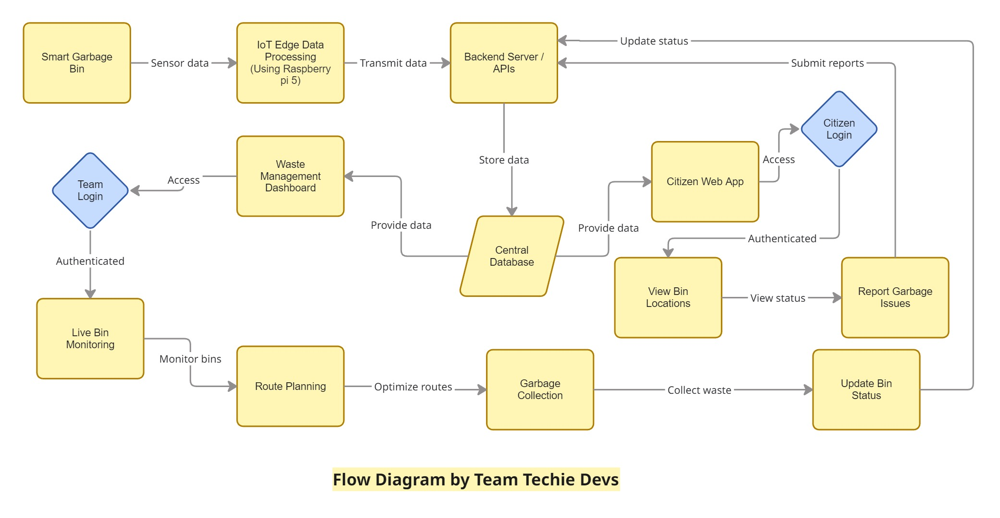

# Smart Waste Management & Citizen Engagement Platform

## Problem Statement

Urban waste management in Indian cities lacks real-time visibility, citizen participation, and operational transparency. Garbage bins often overflow before collection, citizens have no reliable way to locate nearby bins or report issues, and waste management teams rely on fixed routes without accurate data on bin status. This leads to unhygienic surroundings, inefficient resource usage, delayed response to complaints, and lack of accountability in garbage collection processes.

---

## Problem Explanation

In many urban areas, *garbage collection still depends on fixed schedules and manual supervision rather than real-time information*. Garbage bins may __**overflow long before the scheduled pickup, while some bins are collected even when they are not full**__. Citizens are usually the first to notice problems such as overflowing bins, bad odor, or garbage dumped around bins, but existing complaint mechanisms are often slow, unorganized, or ineffective, resulting in delayed action. On the other hand, waste management teams do not have a single, reliable platform to monitor the live status of bins, receive verified reports from citizens, or plan collection routes based on actual need. This lack of coordination between citizens, bin status data, and waste collection teams leads to unhygienic surroundings, inefficient use of resources, poor accountability, and reduced overall cleanliness in cities.

---

## Proposed Solution

## 🔹 Overall System Design

- A **unified, web-based smart waste management platform**
- Integrates **IoT bin data, citizen participation, and waste management operations**
- Single platform with **role-based access** for different users
- Focuses on **real-time visibility, faster response, and transparency**
## 🔁 System Block-Flow Diagram

> *Click the diagram to view the interactive version on Miro.*

---

## 🔹 Citizen Module

- View **nearby garbage bin locations** on an interactive map
- Check **current fill status** of bins (Low / Medium / Full)
- Easy access to the **nearest available bin** for proper waste disposal
- Citizen login for active participation
- Report garbage-related issues such as:
  - Overflowing bins
  - Garbage dumped around bins
  - Missed collection
- Attach **image and location** while reporting
- Reports are directly sent to the waste management team for action

---

## 🔹 Smart Bin & IoT Integration

- Each bin is registered with:
  - Unique ID
  - Fixed geographic location
- IoT sensors monitor:
  - Bin fill level
- Real-time bin status is sent to the backend system
- Bin status is visually represented using color codes
- Reduces dependency on manual inspection

---

## 🔹 Waste Management Team Module

- Secure login for sanitation and collection staff
- Live dashboard displaying:
  - Bin fill status
  - Citizen-reported issues with images
- Identification of **high-priority bins**
- Route suggestions based on:
  - Bin fullness
  - Reported issues
  - Location proximity
- Ability to update bin status:
  - Garbage collected
  - Not collected / delayed
- Automatic generation of **collection logs with timestamps**

---

## Key Features of the Solution

### Citizen Module
- View nearby garbage bin locations on a map  
- Check current fill status of bins (low / medium / full)  
- Citizen login for issue reporting  
- Report overflowing bins or garbage with image and location  
- Easy access to nearest bin for proper waste disposal  

### Smart Bin Monitoring
- IoT-based bin fill-level tracking  
- Real-time status updates to the platform  
- Color-coded bin status for easy understanding  

### Waste Management Team Module
- Secure login for sanitation staff  
- Live dashboard with bin status and citizen reports  
- Route suggestions for efficient garbage collection  
- Ability to update bin status (collected / not collected)  
- Automatic generation of collection logs with timestamps  

### Unified Platform Design
- Single platform for both citizens and authorities  
- Role-based access control  
- Transparent data visibility  
- Scalable architecture for city-wide deployment  

---

## Technology Stack

### Frontend
- HTML, CSS, JavaScript  
- Interactive map interface  
- Responsive web design  

### Backend
- REST APIs  
- Authentication and role-based authorization  
- Report and image handling  
- Bin status and log management
